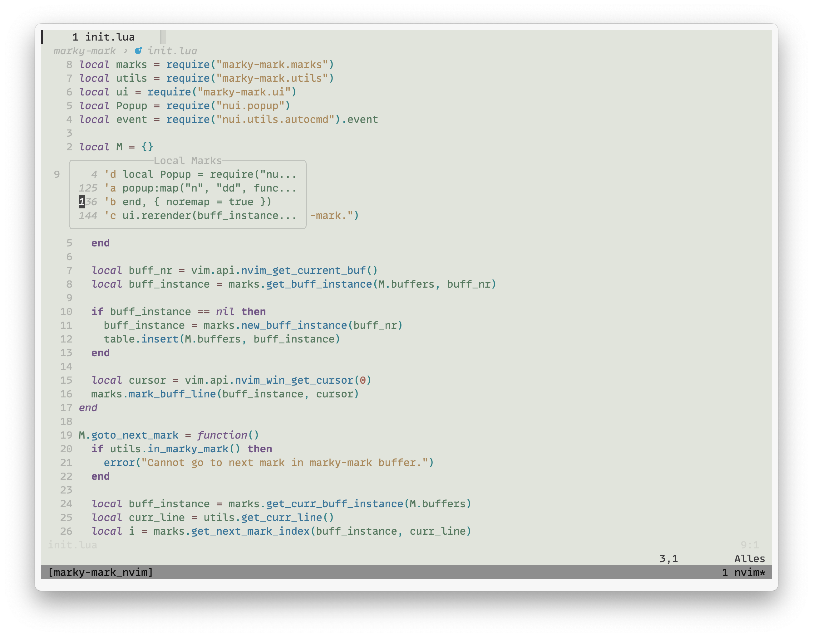

# marky-mark.nvim

* List all local marks and jump to them
* Preview of marked lines
* Easy management of marks
* Jump to next/previous marked line in buffer
* Also saves the cursor position on the line, unlike built-in marks



# Usage
* Create a new mark by pressing `ma` (`add_mark()`)
* List all local marks by pressing `mm` (`show_list()`)
* Use regular VIM keybindings to navigate the list
* Press `enter` to jump to the mark below the cursor
* Press `C-c or q` to exit the list
* Press `dd` or visuall select line(s) and press `d` to delete the mark(s)
* Press `mn` to jump to the next mark in the buffer (`goto_next_mark()`)
* Press `mp` to jump to the previous mark in the buffer (`goto_next_mark()`)
* Standard VIM keybind to go to a mark `'a` also works

# Installation

### [lazy.nvim](https://github.com/folke/lazy.nvim)
```lua
{
  "Laellekoenig/marky-mark.nvim",
  dependencies = {
    "MunifTanjim/nui.nvim"
  },
  config = function()
    require("marky-mark").setup({
      use_default_keymap = true,  --set to false to use own keybindings, e.g. to not overwrite m
      zz_after_jump = true,  --center the screen after jumping to a mark
      popup_width = 35,
    })
  end
}

```

### Customize Keybindings
The default keybindings:

```lua
vim.keymap.set("n", "ma", "<cmd>lua require('marky-mark').add_mark()<cr>", { noremap = true, silent = true })
vim.keymap.set("n", "mm", "<cmd>lua require('marky-mark').show_list()<cr>", { noremap = true, silent = true })
vim.keymap.set("n", "mn", "<cmd>lua require('marky-mark').goto_next_mark()<cr>", { noremap = true, silent = true })
vim.keymap.set("n", "mp", "<cmd>lua require('marky-mark').goto_prev_mark()<cr>", { noremap = true, silent = true })
```
